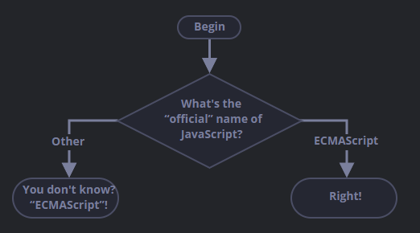

# Challenge 013

## if (a string with zero)

Will `alert` be shown?

```
if ("0") {
    alert('Hello');
}
```

---

# Challenge 014

## The name of JavaScript

Using the `if...else` construct, write the code which asks: `What is the "oficial" name of JavaScript?`

If the visitor enters "ECMAScript", then output "Right!", otherwise - output: "You don't know? ECMAScript!"



---

# Challenge 015

## Show the sign

Using `if..else`, write the code which gets a number via `prompt` and then shows in `alert`:

* `1`, if the value is greater than zero,
* `-1`, if less than zero,
* `0`, if equals zero.

In this task we assume that the input is always a number.

---

# Challenge 016

## Rewrite 'if' into '?'

Rewrite this `if` using the conditional operator `?`:

```
let result;

if (a + b < 4) {
    result = 'Bellow';
} else {
    result = 'Over';
}
```

---

# Challenge 017

## Rewrite 'if..else' into '?'

Rewrite `if..else` using multiple ternary operators `?`.

For readability, it's recommended to split the code into multiple lines.

```
let message;

if (login == 'Employee') {
    message = 'Hello';
} else if (login == 'Director') {
    message = 'Greetings';
} else if (login == '') {
    message = 'No login';
} else {
    message = '';
}
```