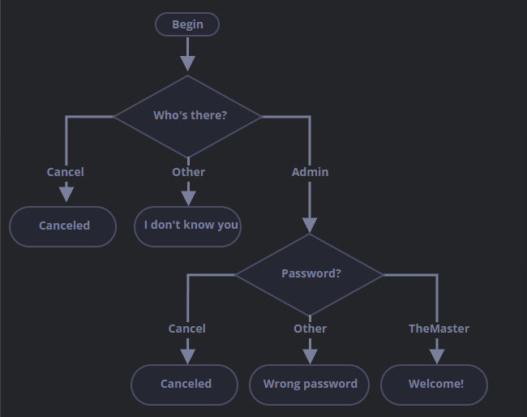

# Challenge 018

## What's the result of OR?

What is the code below going to output?

```
alert(null || 2 || undefined);
```

---

# Challenge 019

## What's the result of OR'ed alerts?

What will the code below output?

```
alert(alert(1) || 2 || alert(3));
```

---

# Challenge 020

## What is the result of AND?

What is this code going to show?

```
alert(1 && null && 2);
```

---

# Challenge 021

## What is the result of AND'ed alerts?

What will this code show?

```
alert(alert(1) && alert(2));
```

---

# Challenge 022

## The result of OR AND OR

What will the result be?

```
alert(null || 2 && 3 || 4);
```

---

# Challenge 023

## Check the range between

Write an `if` condition to check that `age` is between `14` and `90` inclusively.

"Inclusively" means that `age` can reach the edges `14` or `90`.

---

# Challenge 024

## Check the range outside

Write an `if` condition to check that `age` is NOT between `14` and `90` inclusively.

Create two variants: the first one using NOT `!`, the second one - without it.

---

# Challenge 025

## A question about "if"

Which of these `alert`s are going to execute?

What will the result of the expressions be inside `if(...)`?

```
if (-1 || 0) alert('first');
if (-1 && 0) alert('second');
if (null || -1 && 1) alert('third');
```

---

# Challenge 026

## Check the login

Write the code which asks for a login with `prompt`.

If the visitor enters `"Admin"`, then `prompt` for a password, if the input is an empty line or *ESC* - show "Canceled", if it's another string - then show "I don't know you".

The password is checked as follows:

* If it equals "TheMaster", then show "Welcome!",
* Another string - show "Wrong password",
* For an empty sing or cancelled input, show "Canceled"

The schema:



Please use nested `if` blocks. Mind the overall readability of the code.

Hint: passing an empty input to a prompt returns an empty string `''`. Pressing *ESC* during a prompt retuns `null`.