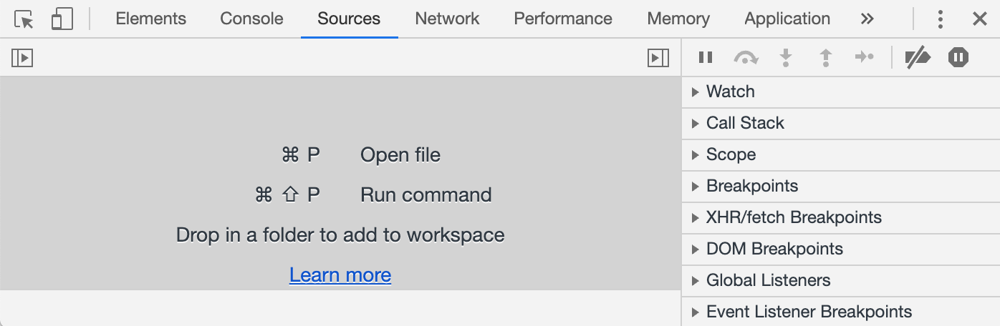
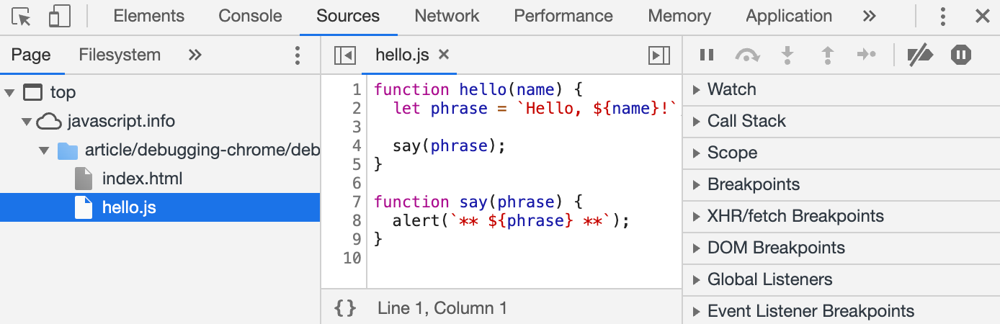
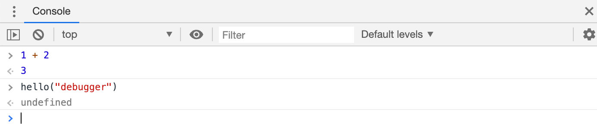
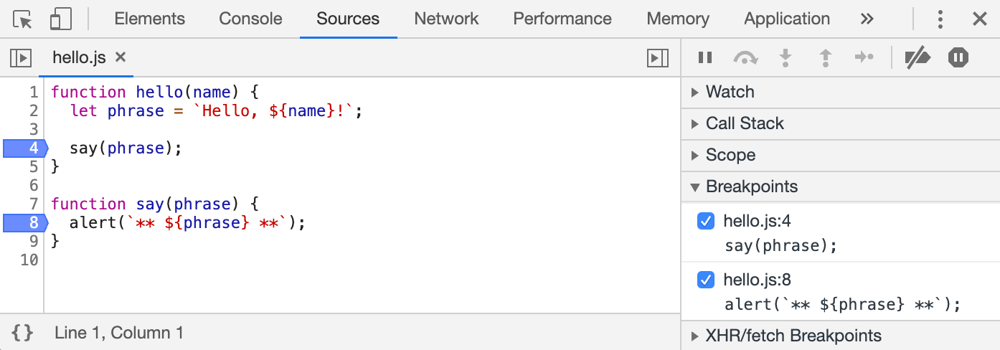
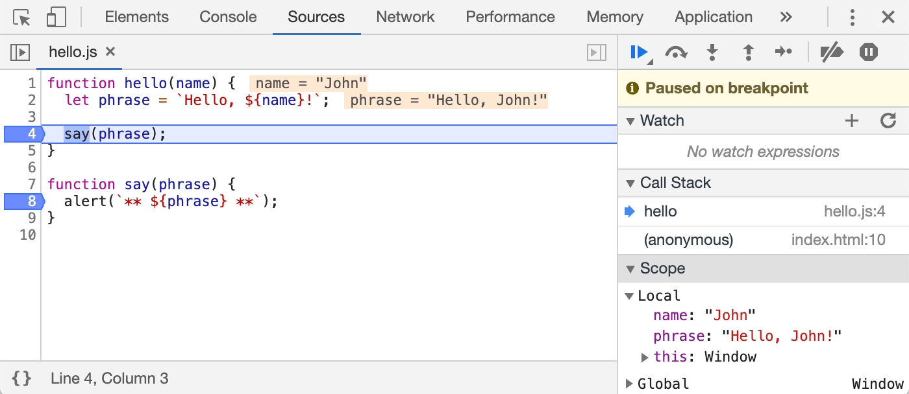
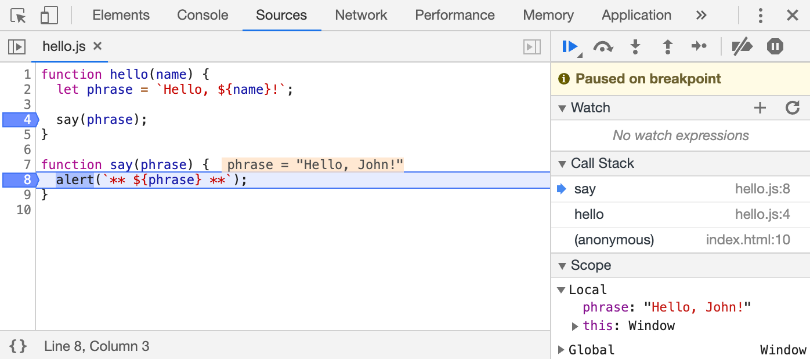

# JavaScript Debugging in the Browser

Debugging is the process of finding and fixing errors in a program. Most modern browsers provide built-in debugging tools that help developers inspect and troubleshoot their code.

## The `Sources` Panel

Open the example page:

[example page](https://javascript.info/article/debugging-chrome/debugging/index.html?utm_source=chatgpt.com)

Then open the Developer Tools by pressing **F12** or by right-clicking the page and selecting **Inspect**. Next, select the **Sources** panel.

Using the toggle button, you can open the file navigator and select a file to view its contents.

The **Sources** panel is divided into three main sections:

1. **File Navigator Panel** - Displays the project's files. Chrome extensions may also appear here.
2. **Code Editor Panel** - Displays the source code of the selected file.
3. **JavaScript Debugging Panel** - Contains debugging tools and controls.

Clicking the toggle button again hides the file navigator and provides more space for the code editor.

---

## Console

While viewing the Developer Tools, press **ESC** to open the Console at the bottom of the screen.

You can type commands into the console and press **ENTER** to execute them.

---

## Breakpoints

Clicking directly on a line number in the code editor creates a breakpoint. The line number will turn blue to indicate that the breakpoint is active.

A breakpoint is a location where the debugger automatically pauses script execution.

While execution is paused, you can inspect variables, execute commands in the console, and analyze the current state of the application.

Multiple breakpoints can be created and managed from the panel on the right side. This panel allows you to:

* Quickly navigate to a breakpoint by clicking it.
* Temporarily disable a breakpoint by unchecking it.
* Remove a breakpoint by right-clicking it and selecting the appropriate option.

Right-clicking a line number also allows you to create a **conditional breakpoint**.

A conditional breakpoint only pauses execution when a specified expression evaluates to `true`.

This is useful when you want to stop execution only for a specific variable value or a specific function argument.

---

## Exercise 089

Code execution can also be paused by using the `debugger` statement.

The statement only works when the Developer Tools are open. Otherwise, the browser ignores it.

As shown in **ex089**.

---

## Pause and Look Around

After creating breakpoints, reload the page using **F5**.

Execution will pause when it reaches a breakpoint.

The panels on the right provide tools for inspecting the current execution state.

### 1. `Watch`

Displays the current values of selected expressions.

Click the `+` button and enter an expression. The debugger will continuously recalculate and display its value while execution progresses.

### 2. `Call Stack`

Displays the chain of nested function calls that led to the current execution point.

You may also see an anonymous call, which appears when there is no explicit function name associated with the current execution context.

Clicking any item in the call stack moves the editor to the corresponding code location, allowing you to inspect its variables and state.

### 3. `Scope`

Displays the currently accessible variables.

* **Local** - Shows local function variables. Their values are often highlighted directly within the source code.
* **Global** - Shows global variables.
* **this** - Displays the value of the `this` keyword, which we have not studied yet.

---

## Tracing the Execution

Several buttons at the top of the debugging panel can be used to control script execution.

### `Resume`

Continues execution until the next breakpoint is reached.

**Shortcut:** `F8`

### `Step`

Executes the next statement.

**Shortcut:** `F9`

### `Step Over`

Executes the next statement without entering any function calls.

**Shortcut:** `F10`

This is similar to **Step**, but if the next statement contains a function call (a user-defined function, not a built-in function such as `alert`), the function executes invisibly and its internal code is skipped.

### `Step Into`

Enters the next function call and pauses inside it.

**Shortcut:** `F11`

Unlike the regular step command, **Step Into** can also follow asynchronous operations (a topic we have not studied yet), allowing you to inspect their execution more closely.

### `Step Out`

Continues execution until the current function finishes.

**Shortcut:** `Shift + F11`

This is useful when you accidentally enter a nested function and want to return to the calling code as quickly as possible.

### `Enable/Disable Breakpoints`

Turns all breakpoints on or off without removing them.

### `Enable/Disable Pause on Exceptions`

Enables or disables automatic pausing when an error occurs.

---

## Exercise 090

To display information in the console directly from our code, we use the `console.log()` function.

Regular users typically do not see this output because it is written to the browser's console.

To view console output, open the **Console** panel in the Developer Tools or press **ESC** while another panel is active to open the console at the bottom of the screen.

As shown in **ex090**.
