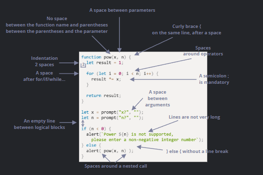

# JavaScript Coding Style

In programming, we often take a complex task and turn it into code that is both correct and readable for humans. A good coding style helps achieve this goal.

## Syntax



Remember that nothing here is absolute. These are style preferences rather than strict language rules.

---

## Exercise 091

In JavaScript, opening braces are typically placed on the same line as the corresponding keyword, with a space before the opening brace.

Many developers wonder whether braces should be used for single-line constructs. Here are some common variations:

1. Beginners sometimes use braces for every single-line construct. This is not a bad practice, but it can make very simple code more verbose.
2. Splitting the statement onto a new line without braces. Never do this. It is very easy to introduce errors when new lines are added later.
3. A single line without braces. This is acceptable only when the statement is short and simple.
4. The preferred style: placing the statement on separate lines and using braces.

For very short code, a single-line statement may be acceptable, but a code block is usually more readable.

As shown in **ex091**.

---

## Exercise 092

Long lines of code should generally be avoided.

The recommended practice is to split long constructs into multiple lines, whether they are strings, `if` statements, function calls, or other expressions.

The maximum line length should ideally be agreed upon by the team.

As shown in **ex092**.

---

## Exercise 093

There are two types of indentation:

### Horizontal Indentation

Usually consists of 2 or 4 spaces.

Indentation can be created using either spaces or the horizontal tab character (`TAB`).

Spaces have become more common because they provide greater consistency and flexibility across different editors.

### Vertical Indentation

Blank lines are used to separate code into logical sections.

Even a single function can be divided into logical blocks using empty lines.

Insert a blank line whenever it improves readability.

As a general guideline, avoid having more than nine consecutive lines of code without some form of vertical separation.

As shown in **ex093**.

---

## Semicolons

Even though semicolons can often be omitted, they should generally be included after every statement.

JavaScript's Automatic Semicolon Insertion (ASI) does not always behave as expected, which can make code vulnerable to subtle bugs.

Experienced developers may choose a semicolon-free style, but unless you fully understand the implications, it is usually safer to include semicolons.

Most developers still use them consistently.

---

## Exercise 094

Avoid deeply nested code whenever possible.

Remember that `continue` and `return` can often be used to reduce nesting and eliminate unnecessary `if` or `if/else` structures.

This usually makes code easier to read and maintain.

As shown in **ex094**.

---

## Exercise 095

There are three common ways to organize functions within a file:

1. Declare functions before the code that uses them.
2. Place the main code first and declare functions afterward.
3. Use a mixed approach, declaring a function near the location where it is first used.

The second approach is often preferred because when reading code, we usually want to understand what it does before examining how it does it.

If descriptive function names are used, it may not even be necessary to read the implementation details immediately.

As shown in **ex095**.

---

## Style Guides

A style guide is a collection of rules and recommendations for writing code.

Within a team, all members should generally follow the same style guide to ensure consistency.

Some popular JavaScript style guides include:

* Google JavaScript Style Guide
* Airbnb JavaScript Style Guide
* Idiomatic.JS
* StandardJS

---

## Automated Linters

Linters are tools that automatically analyze code style and suggest improvements.

In addition to style issues, they can also detect common mistakes such as typos and potential programming errors.

Because of this, using a linter is highly recommended.

Some well-known linting tools are:

* JSLint
* JSHint
* ESLint

Most popular code editors already integrate with one or more linting tools.

To use **ESLint**, the typical setup process is:

1. Install Node.js.
2. Install ESLint using:

```bash
npm install -g eslint
```

3. Create a file named `.eslintrc` in the project's root directory.
4. Install or enable the ESLint extension/plugin for your editor.

Most modern editors already provide one.

Example `.eslintrc` configuration:

```json
{
  "extends": "eslint:recommended",
  "env": {
    "browser": true,
    "node": true,
    "es6": true
  },
  "rules": {
    "no-console": 0,
    "indent": 2
  }
}
```

The `"extends"` property indicates that the configuration is based on the `"eslint:recommended"` ruleset.

After that, custom rules can be added or existing rules can be overridden.

Some IDEs also include built-in linting features, although they are often less customizable than ESLint.

As shown in the examples above.
