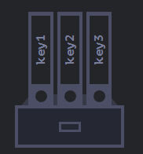

# JavaScript Objects

## Exercise 107

As we have seen, JavaScript has eight data types. Seven of them are called *primitive* because their values contain only a single piece of data.

Objects, on the other hand, store indexed collections of data and more complex entities.

An object can be created using curly braces `{ ... }`, with an optional list of *properties*. A property is a *key: value* pair, where the **key** is a string (also called the property name) and the **value** can be anything.

You can think of an object as a filing cabinet where each file is identified by a key.



An empty object can be created using either `new Object()` or `{}`. Both approaches are valid, but the object literal syntax using curly braces is the one most commonly used.

This declaration is called an *object literal*.

As shown in **ex107**.

---

## Exercise 108

Properties can be assigned immediately when an object is created.

Each property has a key before the colon and a value after it.

Property values can be accessed using **dot notation**, such as `user.name`.

We can also add a new property to an existing object using dot notation. First comes the object's name, then the new property's name, followed by the `=` operator to assign a value, which, as always, can be of any type.

To remove a property, use the `delete` operator, for example:

```javascript
delete user.age;
```

Property names containing multiple words are allowed, but in that case they must be enclosed in quotes.

The last property in an object literal may end with a trailing comma (also called a *final* or *dangling* comma). This makes it easier to add, remove, or rearrange properties because every line follows the same format.

As shown in **ex108**.

---

## Exercise 109

For property names containing multiple words, dot notation does not work because JavaScript interprets it as a syntax error.

Dot notation requires the property name to be a valid JavaScript identifier, meaning it cannot contain spaces, start with a digit, or include special characters other than `$` and `_`.

To solve this, JavaScript provides **bracket notation**, which works with any string.

Brackets also allow property names to be obtained from any expression, for example from the value stored in a variable.

As shown in **ex109**.

---

## Exercise 110

We can also use brackets inside an object literal when creating an object. These are called **computed properties**.

Computed properties allow us to use more complex expressions inside the brackets, making them much more powerful than dot notation because they allow any property name or variable to be used dynamically.

However, they are also more verbose to write.

For this reason, when property names are known beforehand and are simple, dot notation is usually preferred. If something more dynamic is needed, bracket notation is the better choice.

As shown in **ex110**.

---

## Exercise 111

It is very common to use the same names for variables and object properties.

Because this pattern is so common, JavaScript provides a special shorthand.

Instead of writing:

```javascript
name: name
```

we can simply write:

```javascript
name
```

This shorthand can be used together with regular property declarations within the same object.

As shown in **ex111**.

---

## Exercise 112

As we have already learned, variables cannot use names reserved by the language itself, such as `for`, `let`, `return`, and so on.

Object properties, however, do not have this restriction.

There are virtually no limitations on property names.

Other types are automatically converted to strings when used as property keys. For example, the number `0` becomes the string `"0"`.

One exception is the special property `__proto__`, which cannot be assigned a value unless that value is an object.

As shown in **ex112**.

---

## Exercise 113

In JavaScript, we can access any property without causing an error if it does not exist. Instead, the result is simply `undefined`.

Because of this, we can check whether a property exists by comparing it with `undefined` using strict equality.

JavaScript also provides the dedicated `in` operator for this purpose, using the following syntax:

```javascript
"key" in object
```

On the left side of `in` is the property name, which is usually written as a quoted string. Without the quotes, JavaScript assumes it is a variable containing the property's name.

Although comparing with `undefined` often works, the `in` operator is more reliable.

After all, what if a property exists but intentionally stores the value `undefined`?

While this situation is uncommon, since `undefined` is generally not assigned explicitly and `null` is usually preferred instead, the `in` operator remains a valid and safer choice.

As shown in **ex113**.

---

## Exercise 114

To iterate through all the keys of an object, JavaScript provides a special loop called `for..in`.

Its syntax is:

```javascript
for (key in object) {}
```

Remember that, just like other `for` loops, the iteration variable can be declared directly inside the loop, so we would typically write:

```javascript
for (let key in object) {}
```

As shown in **ex114**.

---

## Exercise 115

When iterating through an object, all of its properties are visited, but in a special order.

Properties whose names are integer-like are listed first in ascending numeric order, while all other properties appear in the order they were created.

An **integer property** is a string that can be converted to a number without changing its value.

If this automatic ordering of integer-like properties is undesirable, one workaround is to prepend a `+` to the number when defining the property name. Doing so prevents it from being treated as an integer property, causing it to appear in the order it was added.

As shown in **ex115**.

---

## Additional

JavaScript includes many other built-in object types, such as:

* `Array` — stores ordered collections of data.
* `Date` — stores date and time information.
* `Error` — stores information about an error.
* And many others.
