# JavaScript Garbage Collection

Memory management in JavaScript is performed automatically and invisibly to us. Primitive
types, objects, functions — all of them consume memory.

## Reachability

Reachable values are those that can be used in some way, ensuring they will be kept in
memory. There are values that are always reachable, such as: the currently executing
function along with its local variables and parameters, other functions in the current
chain of nested calls along with their local variables and parameters, and global
variables. All of these are called roots. Any other value is considered reachable if it
can be reached from a root through a reference or a chain of references. In other words,
if we have an object in a global variable and that object references another object, both
of them are considered reachable.

---

## A Simple Example

```js
// user has a reference to the object
let user = {
    name: "John"
};
```

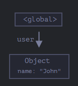

Here the global variable `user` references the object `{name: "John"}`. If the value of
`user` is overwritten, the reference will be lost:

```js
user = null;
```

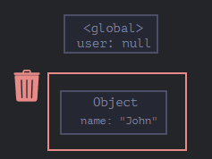

John becomes unreachable, so the garbage collector removes him from memory.

---

## Two References

Now imagine we have two global variables referencing the same object:

```js
// user has a reference to the object
let user = {
    name: "John"
};

let admin = user;
```

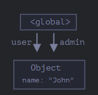

If we do the same as before, the object will still be reachable through `admin`.

---

## Interlinked Objects

```js
function marry(man, woman) {
    woman.husband = man;
    man.wife = woman;

    return {
        father: man,
        mother: woman
    }
}

let family = marry({
    name: "John"
}, {
    name: "Ann"
});
```

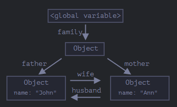

At this point all objects are reachable. But if we remove two references:

```js
delete family.father;
delete family.mother.husband;
```

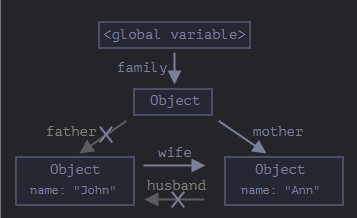

We can now see that John has no incoming references. Outgoing references do not matter —
only incoming references make an object reachable:

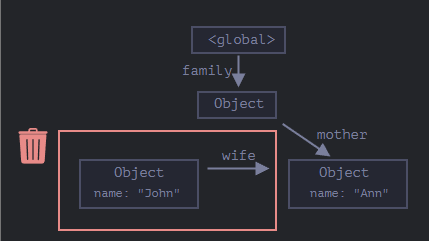

After garbage collection:

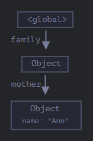

---

## Unreachable Island

We can make an entire island of interlinked objects unreachable. Using the same object as
before, if `family` is overwritten with `null`, the memory image becomes:

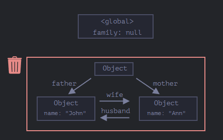

Even though John and Ann are still linked to each other, the `family` object has been
disconnected from the root. Because of this, the entire island becomes unreachable and
will be removed.

---

## Internal Algorithms

The basic garbage collection algorithm is called *mark-and-sweep*. The steps are as
follows: the garbage collector takes the roots and marks them, then visits and marks all
references coming from them, then visits those marked objects and marks their references
— this repeats until all reachable references from the roots have been visited. Finally,
all objects that were not marked are removed.

We can illustrate this entire process:

Here we start with our initial structure, where an unreachable island is clearly visible:

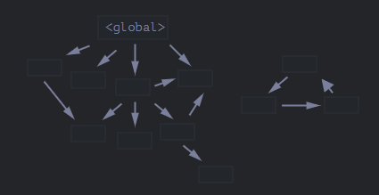

First the roots are marked:

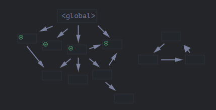

Then their references are followed and the referenced objects are marked:

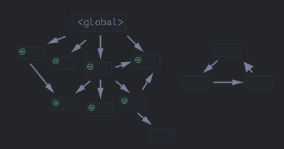

We continue following their references:

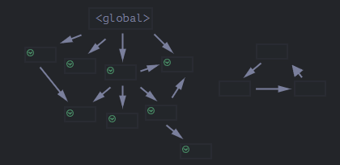

Now the objects that were not visited are considered unreachable and will be removed:

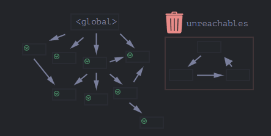

That is the core concept of how it all works. JavaScript engines apply many optimizations
to make the code run faster and avoid introducing delays. Some of those optimizations are:

- **Generational collection** — objects are divided into "new" and "old". Objects that
survive long enough are treated as old and examined less frequently.
- **Incremental collection** — instead of one large garbage collection pass, it is divided
into several smaller ones executed one at a time, spreading the delay instead of causing
one large pause.
- **Idle-time collection** — the garbage collector tries to run only when the CPU is idle,
reducing its potential impact on execution.