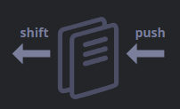
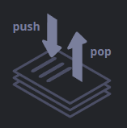
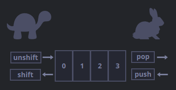
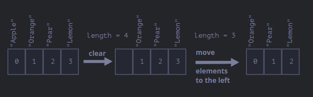
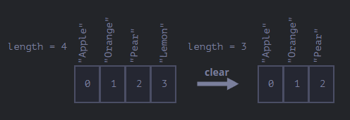

# Arrays

## Exercise 163

Objects allow us to store collections of values indexed by keys, but at some point we
will need to store an ordered list of something. Objects are not convenient for this since
they do not offer methods to manage the order of elements or allow us to insert new
properties between existing ones. For this purpose there is a special data structure
called `Array`, which stores ordered collections.

To create an array we have two syntaxes: `let arr = new Array();` and `let arr = [];`.
The second is the most commonly used, and we can already provide initial elements inside
the brackets or parentheses depending on the chosen syntax. Each element is numbered
starting from zero, and we can retrieve any of them by their index, as well as replace or
add new elements. We count the elements in an array using `length`, and we can use
`alert` to display the entire list.

An array can store elements of any type. Just like objects, arrays can end with a trailing
comma, which makes it easier to add or remove items since all lines look the same, as
shown in **ex163**.

---

## Exercise 164

A recent addition to the language is the `at` method. Previously JavaScript did not
support negative indices for arrays — something we already saw with strings. To reach the
last elements easily, we would have to calculate explicitly, like `fruits[fruits.length - 1]`.
There is a much shorter way: `fruits.at(-1)`, which counts back from the end of the array
when given a negative value, as shown in **ex164**.

---

## Exercise 165

An array can be used in two ways:

As a **queue**, which supports two operations: `push`, which appends an element to the
end, and `shift`, which removes an element from the beginning, advancing the queue so that
the second element becomes the first.

And as a **stack**, which also supports two operations: `push`, which adds an element to
the end, and `pop`, which removes an element from the end.

Stacks follow the LIFO principle (Last-In-First-Out), while queues follow FIFO
(First-In-First-Out). Arrays can function as both.

The methods that work with the end of the array are:
- `pop` — extracts the last element and returns it.
- `push` — appends an element to the end of the array.

The methods that work with the beginning of the array are:
- `shift` — extracts the first element and returns it.
- `unshift` — adds an element to the beginning of the array.

Both `push` and `unshift` can add multiple elements at once, as shown in **ex165**.

---

## Performance

The `push/pop` methods execute faster, while `shift/unshift` are slower.

This is because `shift/unshift` operations require 3 steps: removing or adding a new
index `0`, moving all elements left or right, and renumbering all other indices. The more
elements there are, the more time it takes, with more operations being performed in
memory.

On the other hand, `push/pop` do not need to move anything. `pop` simply clears the last
index and shortens `length`, and the same applies to `push`, which is why they are much
faster.

---

## Exercise 166

One way to iterate over the elements of an array is using a `for` loop over its indices.
However, arrays also support `for..of`, which does not give access to the current
element's index, only its value — making it shorter and sufficient for most cases.

Since arrays are also objects, it is possible to use `for..in` as well, but it is not
recommended. It iterates over all properties, and there are objects called *array-like*
in browsers and other environments that have properties like indices but may also have
non-numeric properties and methods that we usually do not need. Another issue is that
`for..in` is optimized for generic objects and is much slower when used with arrays, as
shown in **ex166**.

---

## Exercise 167

`length` does not count all the values in a list — it returns the greatest numeric index
plus one. We can use `length` to truncate an array by decreasing its value. The simplest
way to clear an array is `arr.length = 0`, as shown in **ex167**.

---

## Exercise 168

As we have seen, the syntax `let arr = new Array()` also creates an array, but it is
rarely used. There is an important behavior to be aware of: when `new Array` is called
with a single numeric argument, it creates an array with no elements but with the given
length. If we try to access any of its elements, the returned value will always be
`undefined`. To avoid this, square brackets are generally preferred, as shown in
**ex168**.

---

## Exercise 169

Arrays can contain other arrays, creating multidimensional arrays. Arrays have their own
way of being converted to a string, with their elements separated by commas. Arrays do
not have `Symbol.toPrimitive` or a viable `valueOf` — they only implement `toString`
conversion, where `[]` becomes an empty string, `[1]` becomes `"1"`, and `[1,2]` becomes
`"1,2"`. When the binary addition operator adds an array — even one with numeric values —
to a numeric value, it will always return a string, since adding a string to a number
always converts the result to a string, as shown in **ex169**.

---

## Exercise 170

In JavaScript, arrays should not be compared with the `==` operator, since it has no
special treatment for arrays and works the same way as with any object. Reviewing the
rules: an object is only equal to another if both are references to the same object; if
one argument is an object and the other a primitive, the object is converted to a
primitive; and `null` and `undefined` are only equal to each other. Strict comparison is
simpler since it does not convert types.

Therefore, comparing two different arrays will never return `true`, unless both variables
reference the exact same array. If an array is compared to a primitive, it is also
converted to a primitive string. An empty array compared to a primitive becomes an empty
string. To compare arrays correctly, compare them item by item in a loop, as shown in
**ex170**.
