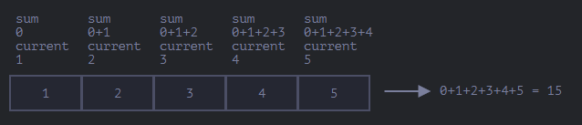

# Array Methods

## Exercise 171

Arrays have many methods. Besides the ones for adding and removing items that we have
already seen, there are many others. Starting with the need to delete an element from an
array — since arrays are also objects, we can use `delete` for that. However, it does
remove the indicated element but does not shift the remaining elements to fill the empty
space, leaving the array length unchanged.

To delete an element from an array correctly, we use `splice` with the following syntax:
`arr.splice(start[, deleteCount, elem1, ..., elemN])`. The method modifies the array
starting from the given index, removes the indicated number of elements, and can insert
new elements in their place. It also returns the removed elements, which can be stored in
a variable. We can also use this method to only insert new elements at a given index
without removing anything. Negative values are also supported, counting from the end of
the array, as shown in **ex171**.

---

## Exercise 172

There is also the `slice` method, which we have already seen with strings. In the context
of arrays, it returns a copy of the array from a start index up to but not including the
end index. Negative values are supported, counting from the end. If no values are
provided, the start defaults to zero and the end covers all elements to the end of the
array, as shown in **ex172**.

---

## Exercise 173

Another method is `concat`, which creates a new array including values from other arrays
and additional items, following this syntax: `arr.concat(arg1, arg2...)`. It accepts both
arrays and values, and always returns a new array with the new elements appended. Other
objects, even those that look very similar to arrays, are added as a whole — unless the
object has the special property `Symbol.isConcatSpreadable`, in which case it is treated
as an array and its elements are spread in instead of added as a single item, as shown in
**ex173**.

---

## Exercise 174

The `forEach` method allows us to execute a function for each element of the array, with
the following syntax: `arr.forEach(function(item, index, array) { // ... do something with an item });`.
With it we can display each element of an array or get more detail about their positions.
If the function returns a value, it is discarded and ignored, as shown in **ex174**.

---

## Exercise 175

Now we look at methods that perform searches in an array, starting with `indexOf` and
`includes` — the same ones we have already seen with strings, working the same way but
for array elements instead of characters.

`arr.indexOf(item, from)` searches for the item from the given index and returns the
index where it was found, or `-1` if not found. `arr.includes(item, from)` searches for
the item from the given index and returns `true` if found, otherwise `false`. The second
argument is optional in both methods. Note that `indexOf` uses strict equality `===`.

There is also `lastIndexOf`, a variation of `indexOf` that searches from right to left.

One curiosity is that `NaN` is only handled correctly by `includes`, which returns `true`
when it finds it in a list. `indexOf` returns `-1` in such cases because `includes` was
added to the language much later and adopted a more up-to-date comparison algorithm, as
shown in **ex175**.

---

## Exercise 176

To find an object in an array matching a specific condition, we use the `find` method
with the following syntax: `let result = arr.find(function(item, index, array) { ... });`.
The function is called for each element — `item` is the element, `index` is its position,
and `array` is the list itself. If `true` is returned at any point, the search stops and
the item is returned. If nothing is found, `undefined` is returned. Generally only the
first argument is used, the others are rarely needed.

We also have `findIndex`, which returns the index where the element was found, or `-1`
if not found, and `findLastIndex`, which does the same but searches from right to left,
as shown in **ex176**.

---

## Exercise 177

The `find` method looks for a single element that makes the function return `true`. If
there are multiple elements that satisfy the condition and we want all of them, we use
`filter` with the following syntax:
`let results = arr.filter(function(item, index, array) { ... });`, as shown in **ex177**.

---

## Exercise 178

Moving on to methods that transform and reorder arrays, starting with `map`, which
executes a function for each element and returns a new array of all the results, with the
following syntax: `let results = arr.map(function(item, index, array) { ... });`, as
shown in **ex178**.

---

## Exercise 179

`arr.sort()` sorts the array in place, changing the order of its elements. In its generic
form it does not work well with numbers, since it converts all elements to strings for
comparison, which can produce unexpected ordering for numeric types.

To use our own ordering, we provide a function that returns a positive value, a negative
value, or zero for each comparison. A positive value means the first element is greater
and should come after the second, negative means the opposite, and zero means the order
does not matter. This is why a custom function is needed — the default algorithm only
works correctly for strings.

The function for sorting numbers can be greatly simplified to a single short line using
an arrow function, since the subtraction between the two values already returns positive,
negative, or zero naturally.

For strings, we encounter the same linguistic differences seen before — some languages
have letters with special symbols that have different codes in generic string comparison.
To sort them correctly we provide a function that uses `localeCompare`, which identifies
the language and compares accordingly, returning the values `sort` expects, as shown in
**ex179**.

---

## Exercise 180

The `reverse` method reverses the order of the elements in an array, as shown in
**ex180**.

---

## Exercise 181

When we want to turn a single string containing a list of values into a real array where
each value is an element, we use `str.split(delim)`, which splits the string by the
provided delimiter. It has an optional second argument to limit the array length, ignoring
extra elements, but it is rarely used. Calling `split` with an empty string splits the
string character by character.

The opposite operation is `arr.join(glue)`, which creates a string from an array where
each item is separated by the `glue` value, as shown in **ex181**.

---

## Exercise 182

When we need to iterate over an array we use `forEach`, `for`, or `for..of`. When we
need to iterate and return data for each element, we use `map`. But when we want to
calculate a single value based on the array, we use `reduce` or `reduceRight`, which
follow the same syntax:
`let value = arr.reduce(function(accumulator, item, index, array) { ... }, [initial]);`.

The arguments are: `accumulator` — the result of the previous function call, equal to
`initial` on the first call if provided; `item` — the current array item; `index` — its
position; `array` — the list itself. The accumulator stores the combined result of all
previous executions and becomes the final result of `reduce`.

For a list like `[1, 2, 3, 4, 5]`, with a function that adds the current value to the
sum and an initial value of zero:

| Call | `sum` | `current` | Result |
|------|-------|-----------|--------|
| 1st | 0 | 1 | 1 |
| 2nd | 1 | 2 | 3 |
| 3rd | 3 | 3 | 6 |
| 4th | 6 | 4 | 10 |
| 5th | 10 | 5 | 15 |

We can also omit the initial value, in which case the accumulator starts as the first
element and the current value starts from the second. The result is the same for a
standard list, but if the array is empty and no initial value is provided, there is
nothing for the accumulator to start with, resulting in an error. It is therefore
recommended to always provide an initial value. `reduceRight` follows the same logic but
processes the array from right to left, as shown in **ex182**.

---

## Exercise 183

Since arrays are based on objects, using `typeof` on both an array and an object returns
`"object"`. Because arrays are so commonly used, there is a special method to identify
them: `Array.isArray(value)`, which returns `true` if `value` is an array and `false`
otherwise, as shown in **ex183**.

---

## Exercise 184

Almost all array methods that call functions — such as `find`, `filter`, and `map`, with
the exception of `sort` — accept a rarely used optional parameter called `thisArg`:
`arr.find(func, thisArg)`, `arr.filter(func, thisArg)`, `arr.map(func, thisArg)`.

The value of `thisArg` becomes `this` for the function. Without it, the function would be
called independently, potentially causing an error. There are two ways to make the call:
`users.filter(army.canJoin, army)` or `users.filter(user => army.canJoin(user))` — the
second form is generally easier to understand, as shown in **ex184**.

---

## Exercise 185

Besides `sort`, `reverse`, and `splice`, there are other useful methods. `arr.some(fn)`
and `arr.every(fn)` check the array by calling a function for each element, similar to
`map`. They behave like the `||` and `&&` operators respectively — `some` returns `true`
immediately if the function returns `true` for any element, and `every` returns `false`
immediately if the function returns `false` for any element. We can use `every` to compare
arrays, for example, as shown in **ex185**.

---

## Additional

Other less commonly used methods include:

- `arr.fill(value, start, end)` — fills the array with repeated `value` from index
`start` to `end`.
- `arr.copyWithin(target, start, end)` — copies elements from position `start` to `end`
within the array itself, placing them at the `target` position.
- `arr.flat(depth)` / `arr.flatMap(fn)` — create a new array from a multidimensional
array.
