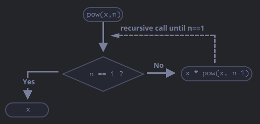
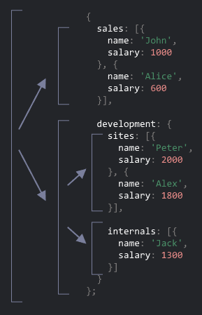
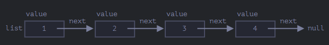
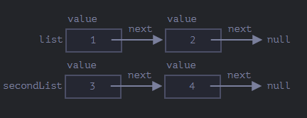
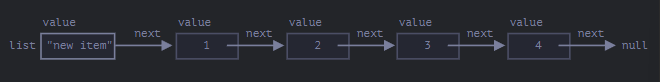
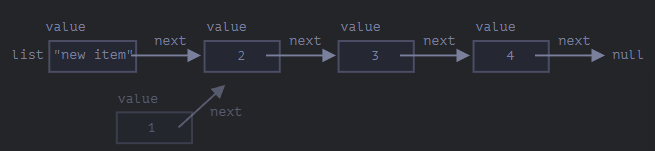

# Recursion and Stack

*Recursion* is useful in situations where a task can be split into multiple simpler tasks
of the same type, or when a task can be simplified into one action plus a simpler variant
of the same task, or for dealing with certain data structures.

## Exercise 227

Starting with a function `pow(x, n)` as an example, which raises `x` to the power of
`n`, there are two ways to think about it:

- **Iterative thinking** — using a `for` loop.
- **Recursive thinking** — simplifying the task and calling itself.

The recursive variant is fundamentally different, splitting into two branches:

- If `n == 1`, everything is trivial — this is called the *base case* of the recursion,
producing the result immediately.
- Otherwise, we represent `pow(x, n)` as `x * pow(x, n - 1)` — this is called the
*recursive step*, transforming the task into a simpler action (a multiplication) and a
simpler call of the same task. The next steps simplify further until the base case is
reached.

We can also say that `pow` calls itself recursively until `n == 1`:

For example, to calculate `pow(2, 4)`:

1. `pow(2, 4) = 2 * pow(2, 3)`
2. `pow(2, 3) = 2 * pow(2, 2)`
3. `pow(2, 2) = 2 * pow(2, 1)`
4. `pow(2, 1) = 2`

A recursive solution is generally shorter than an iterative one. We can make `pow(x, n)`
even more concise using the conditional operator `?`. The maximum number of nested calls
is called the *recursion depth*, which JavaScript limits — we can consider it to be
around 10,000. There are automatic optimizations called tail call optimizations that help
mitigate this, but they are not supported everywhere and only work in simple cases. This
limits the application of recursion, but it remains very broad — there are many tasks
where recursive thinking results in simpler and more maintainable code, as shown in
**ex227**.

---

## The Execution Context and Stack

To understand how recursive calls work, let's look at how the execution of **ex227**
works internally. The information about the execution process of a running function is
stored in its *execution context* — an internal data structure containing details about
the function's execution: where the control flow currently is, the current variables, the
value of `this`, and some other internal details.

When a function makes a nested call, the following happens:

1. The current function is paused.
2. Its execution context is stored in a special data structure called the *execution
context stack*.
3. The nested call executes.
4. After it finishes, the previous execution context is retrieved from the stack and the
outer function resumes from where it left off.

In the `pow(2, 3)` call from **ex227**, the execution context stores `x = 2, n = 3` with
the flow at line 1: `Context: { x: 2, n: 3, at line 1 }`. The condition `n == 1` is
false, so execution continues to the second branch: `Context: { x: 2, n: 3, at line 5 }`.
To calculate `x * pow(x, n - 1)`, a subcall `pow(2, 2)` is made. JavaScript saves the
current context to the stack, creates a new context for the subcall, and when it
finishes, restores the previous context.

The context stack when inside `pow(2, 2)`:
- `Context: { x: 2, n: 2, at line 1 }` ← current
- `Context: { x: 2, n: 3, at line 5 }` ← stored

The process repeats — another subcall is made with `x=2, n=1`, creating a new context
and pushing the previous one:
- `Context: { x: 2, n: 1, at line 1 }` ← current
- `Context: { x: 2, n: 2, at line 5 }`
- `Context: { x: 2, n: 3, at line 5 }`

We now have 2 stored contexts and 1 currently executing.

---

## The Exit

Still in **ex227**, during the execution of `pow(2, 1)`, the condition `n == 1` becomes
true and the function returns `2`. Its context is removed from memory and the previous
context is restored from the top of the stack:
- `Context: { x: 2, n: 2, at line 5 }`
- `Context: { x: 2, n: 3, at line 5 }`

The execution of `pow(2, 2)` resumes with the result of `pow(2, 1)`, completing the
evaluation of `x * pow(x, n - 1)` and returning `4`. The previous context is then
restored: `Context: { x: 2, n: 3, at line 5 }`, and `pow(2, 3) = 8` is the final result.

In this case the recursion depth was **3**, since that was the maximum number of contexts
on the stack at any point. A loop-based algorithm uses less memory. Any recursion can be
rewritten as a loop, though sometimes the rewrite is not trivial — especially when a
function uses different recursive subcalls depending on conditions and combines their
results. In most cases, we simply need efficient and readable code, and optimization is
not always necessary.

---

## Exercise 228

Another application of recursion is recursive traversal. Imagine a company represented
as an object with departments. A department can have a team, or it can be split into
subdepartments, each with their own team. When a subdepartment grows, it can further
split into sub-subdepartments.

To write a function that sums all salaries, we could use an iterative approach — but it
is not easy. If more subdepartments appear, we would need even more nested loops, making
the code very complex. Recursion handles this naturally.

When the function receives a department to sum, there are two cases:

- It is a simple department with a list of people — we sum the salaries in a simple loop.
- It is an object with `n` subdepartments — we make `n` recursive calls to get the sum
of each and combine the results.

The first case is the base of the recursion (when we receive an array). The second case
is when we receive an object — a complex task split into subtasks for smaller departments,
which may be split again, but at some point the division ends at an array.

The code becomes shorter and easier to understand, and works for any level of
subdepartment nesting. Below is the diagram of the calls:

Subcalls are made for objects, while arrays are the leaves of the recursion tree. The
code uses previously learned features: `arr.reduce` to get the array sum, and
`for (val of Object.values(obj))` to iterate over the object's values, as shown in
**ex228**.

---

## Exercise 229

The natural choice for storing an ordered list of objects would be an array, but there
is a problem — inserting and deleting elements is costly, since the operation needs to
renumber all elements to open or close space. For large arrays this takes time. The only
operations that do not require mass renumbering are those acting on the end of the array.

An alternative data structure that makes these operations faster is called a *linked
list*. Each element is an object with a `value` and a `next` property that references the
next element, or `null` if it is the last:

There are multiple objects, each with a value and a `next` pointing to its neighbor.
Following `next` we can reach any element, and the list can easily be split and rejoined.

To add a new value at the beginning, we only need to update the first element:

To remove a value from the middle, we change the `next` of the previous element to skip
over it:

Unlike arrays, there is no mass renumbering. However, linked lists are not always better
than arrays — the main disadvantage is that we cannot easily access an element by its
index. Still, they are very useful when we need fast addition or removal at either end
without needing access to the middle.

Linked lists can also be enhanced: we can add a `prev` property in addition to `next` to
reference the previous element, making it easy to go backwards. We can also add a `tail`
variable pointing to the last element, updating it when elements are added or removed
from the end. The data structure can vary according to our needs, as shown in **ex229**.
