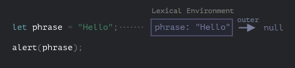
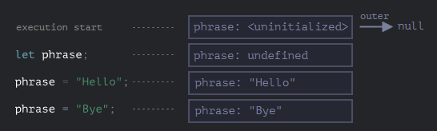
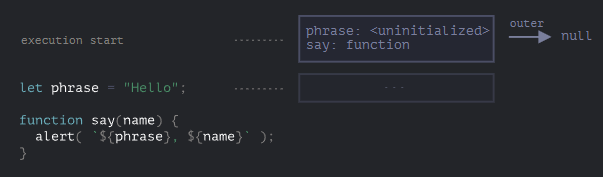
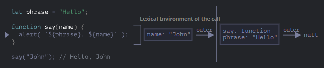
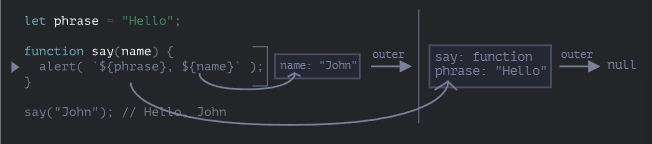
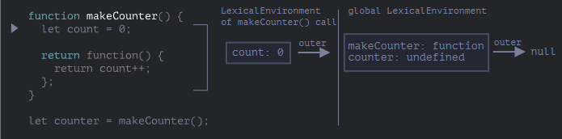
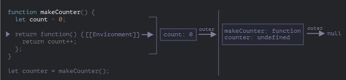
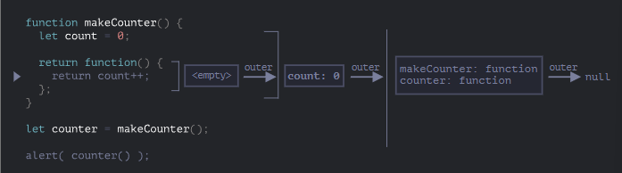
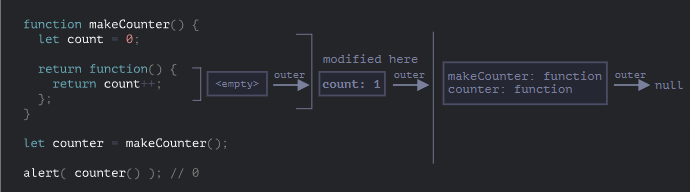

# Variable Scope, Closure

## Exercise 234

If a variable is declared inside a code block `{...}`, it is only visible within that
block — we can use this to isolate code sections. For `if`, `for`, and `while`, variables
declared inside `{...}` are also only visible within them. Since `for` is a special
construct, a variable declared inside it is considered part of the block, as shown in
**ex234**.

---

## Exercise 235

A nested function is a function inside another function. A nested function can access
outer variables and can be returned as a property of a new object or as a result itself.
No matter where it is used, it will still have access to the same outer variables, as
shown in **ex235**.

---

## Lexical Environment

### Step 1. Variables

Every running function, code block, and script has an internal hidden object associated
with it known as the *Lexical Environment*, which consists of two parts:

1. *Environment Record* — an object that stores all local variables as its properties,
along with other information such as the value of `this`.
2. A reference to the *outer Lexical Environment*, the one associated with the outer
code.

A variable is a property of the special *Environment Record* object. Getting or changing
a variable means getting or changing a property of that object. Below is an example of
simple code:

This is the global Lexical Environment, associated with the entire script. The rectangle
represents the Environment Record and the arrow represents the outer reference. Since the
global Lexical Environment has no outer reference, it points to `null`. Below is an
example of longer code:

The rectangles show how the global Lexical Environment changes during execution:

1. When the script starts, the Lexical Environment is pre-populated with all declared
variables in an uninitialized state — the engine knows the variable exists but it cannot
be referenced until declared, as if it did not exist.
2. Then `let phrase` appears — no assignment yet, so its value is `undefined`. The
variable can be used from this point on.
3. A value is assigned to `phrase`.
4. `phrase` changes its value.

In summary: a variable is a property of a special internal object associated with the
currently executing block, function, or script. Working with variables is working with
the properties of that object. The Lexical Environment is a specification object — it
exists only in theory and cannot be obtained or manipulated directly in code. JavaScript
engines may also optimize it, discarding unused variables and performing other internal
tricks, as long as the visible behavior remains as described.

### Step 2. Function Declarations

A function is also a value, just like a variable, with one difference — a function
declaration is initialized instantly and in full. When a Lexical Environment is created,
a function declaration immediately becomes a ready-to-use function, unlike `let` which is
unusable until declared. This is why we can call a function even before its declaration.
Below is an example:

This behavior applies only to function declarations, not to function expressions, where a
function is assigned to a variable such as `let say = function(name)...`.

### Step 3. Inner and Outer Lexical Environment

When a function runs, a new Lexical Environment is created automatically to store its
local variables and call parameters. Below is an example with `say("John")`:

Here we have two Lexical Environments — the inner one for the current function call, and
the outer global one. The inner one corresponds to the current execution of `say` and has
a single property `name`. When `say("John")` is called, `name` becomes `"John"`. The
outer one contains `phrase` and the function itself.

When code needs to access a variable, it first searches the inner Lexical Environment,
then the outer one, then the one further out, and so on until the global environment. If
a variable is not found anywhere, an error occurs — without strict mode, assigning to a
non-existent variable creates a new global variable.

In our example: first, for the variable `name`, the `alert` finds it immediately in the
inner Lexical Environment of `say`. Second, when it tries to access `phrase`, it is not
there, so it follows the reference to the outer Lexical Environment and finds it there:

### Step 4. Returning a Function

Going back to the example from **ex235**, at the start of each call a new Lexical
Environment object is created to store the variables for that execution. So we have two
nested Lexical Environments:

During the execution of `makeCounter()`, a small one-line nested function is created. All
functions store a reference to the Lexical Environment in which they were created — they
have a hidden property called `[[Environment]]` that holds this reference.

Therefore `counter.[[Environment]]` has a reference to `{count: 0}`. This reference is
set once and remains permanently from the moment the function is created. When `counter()`
is called, a new Lexical Environment is created and its outer reference is taken from
`counter.[[Environment]]`:

When `counter()` looks for `count`, it first searches its own Lexical Environment, does
not find it, then goes to the outer Lexical Environment of `makeCounter()`, where it
finds and modifies it:

With multiple calls, `count` increments to `2`, `3`, and so on. There is a term called
*closure* — a function that remembers its outer variables and can access them. In some
languages this is not possible, but in JavaScript all functions are closures by nature,
meaning they automatically remember where they were created.

---

## Exercise 236

A Lexical Environment is removed from memory along with all its variables after the
function completes, since there are no more references to it — any JavaScript object is
only kept in memory while it is reachable. If there is a nested function that is still
accessible, it has a property referencing the Lexical Environment, so it remains
reachable even after the outer function completes. If a function is called multiple times
and the resulting functions are saved, all corresponding Lexical Environment objects are
kept in memory. A Lexical Environment object exists only as long as there is at least one
nested function referencing it — once the nested function is removed, its Lexical
Environment is cleared from memory, as shown in **ex236**.

---

## Exercise 237

In theory, while a function is active all outer variables are kept as well. In practice
however, JavaScript tries to optimize this by analyzing variable usage — if an outer
variable is not being used, it is removed and becomes unavailable during debugging. This
can lead to debugging issues, such as encountering an outer variable with the same name
instead of the expected one. This is not a bug but rather a specific behavior of the V8
engine, as shown in **ex237**.
